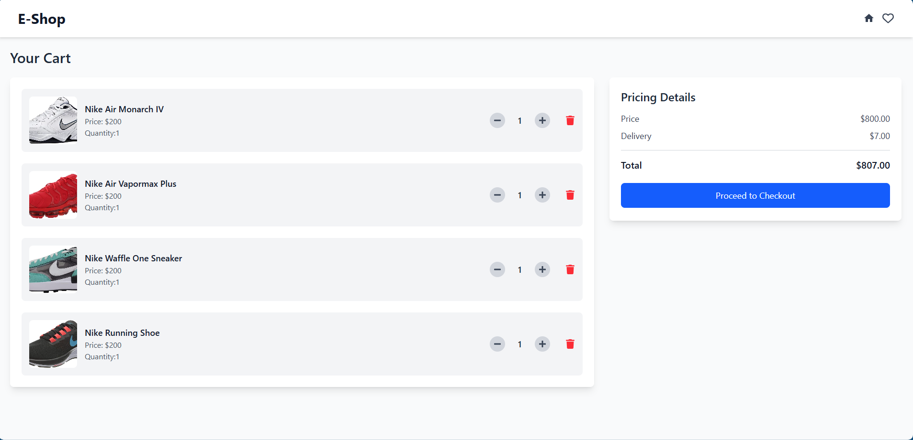

# Hermes E-Commerce Website

## 🚀 Overview
Hermes is a modern and stylish e-commerce website built with React, offering a seamless shopping experience for fashion enthusiasts. This frontend project showcases an elegant UI, responsive design, and user-friendly navigation to enhance the online shopping experience.


## 🌟 Images



## 🌟 Features
- 🛍️ Beautiful and intuitive UI/UX
- 📱 Fully responsive design for all devices
- 🔍 Product listings with detailed descriptions
- 🎨 Modern and clean styling with Tailwind CSS
- 🛒 Interactive shopping cart functionality
- 📦 Order tracking UI

## 🛠️ Technologies Used
- **React.js** - Frontend framework
- **Tailwind CSS** - Styling and responsiveness
- **React Router** - Navigation handling
- **Context API** - State management

## 📂 Project Structure
```
Hermes-Ecommerce/
│── public/
│── src/
│   ├── components/   # Reusable UI components
│   ├── screenshots/  # images of homePage and cart 
│   ├── pages/        # Main pages (Home, Shop, Orders, etc.)
│   ├── context/      # Global state management
│   ├── assets/       # Images and icons
│   ├── App.js        # Main app component
│   ├── index.js      # Entry point
│── package.json      # Project dependencies
│── README.md         # Project documentation
```

## 🔧 Installation & Setup
1. Clone the repository:
   ```sh
   git clone https://github.com/nishchayMish/React-Ecommerce.git
   ```
2. Navigate to the project directory:
   ```sh
   cd hermes-ecommerce
   ```
3. Install dependencies:
   ```sh
   npm install
   ```
4. Start the development server:
   ```sh
   npm start
   ```

## 🚀 Deployment
To deploy the project using Vercel or Netlify:
```sh
npm run build
```
Then follow the respective platform's deployment process.

## 📬 Contact
📍 **Address:** 123 Fashion Avenue, Rosewood District, New Delhi, India – 110001  
📞 **Phone:** +91 7877033944  
📧 **Email:** nishchaymishra2100@gmail.com
🌐 **Website:** [www.hermes.com](#)