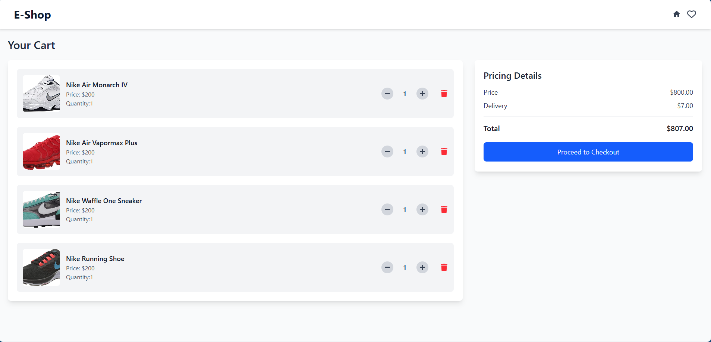
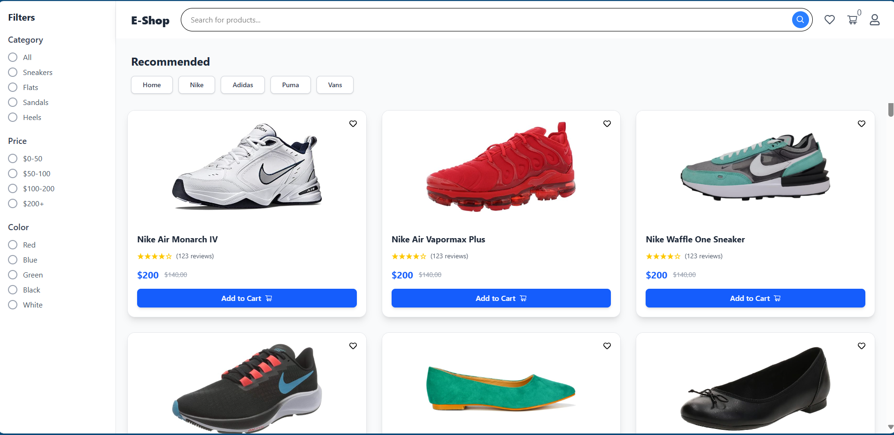

# 🛍️ E-Commerce Website (Frontend)

Welcome to the **E-Commerce Website** frontend repository! This project showcases a clean, modern, and responsive UI for an online shopping platform. Built with the latest web technologies, it ensures a smooth and engaging user experience. 🎉

---

## 🌟 Features
- **Responsive Design** – Fully optimized for mobile, tablet, and desktop devices 📱💻
- **Modern UI/UX** – Clean, elegant, and user-friendly interface 🎨
- **Product Listings** – Beautifully displayed product grids with filtering and sorting 🛒
- **Shopping Cart** – Interactive cart with add/remove functionality 🛍️
- **Wishlist** – Interactive Wishlidt with add/remove functionality 💖
- **Easy Navigation** – Intuitive sidebar and navbar for seamless browsing 🚀

---

## 🛠️ Tech Stack
- **HTML** – Structuring the webpage 🏗️
- **CSS / Tailwind CSS** – Styling with responsiveness 🎨
- **JavaScript** – Adding interactivity ⚡
- **React** – Adding JSX ⚛️

---

## 📸 Screenshots




---

## 🚀 Getting Started
### 1️⃣ Clone the Repository
```sh
git clone https://github.com/nishchayMish/React-Ecommerce.git


### 2️⃣ Install Dependencies (if applicable)
```sh
npm install  # For projects using npm
```

### 3️⃣ Run the Project
```sh
npm run dev  # If using React or another framework
```

---

## 📌 Folder Structure
```
📂 ecommerce-frontend
 ┣ 📂 Database      # Images, icons, fonts
 ┣ 📂 components    # Reusable UI components
 ┣ 📂 context       # Used To Reference 
 ┣ 📂 pages         # Page layouts (Home, Product, Cart, etc.)
 ┣ 📂 styles        # CSS or Tailwind styles
 ┣ 📜 index.html    # Main entry point
 ┣ 📜 index.css     # Main Styling file
 ┣ 📜 App.jsx       # JSX functionality
 ┣ 📜 main.jsx      # JSX functionality
 ┗ 📜 README.md     # Project documentation
```

---

## 🤝 Contributing
Contributions are welcome! If you’d like to improve the project, follow these steps:
1. **Fork** the repository 🍴
2. **Create a feature branch** (`git checkout -b feature-branch`) 🌿
3. **Commit your changes** (`git commit -m 'Added new feature'`) ✅
4. **Push to the branch** (`git push origin feature-branch`) 🚀
5. Open a **Pull Request** 🔥

---

## 📬 Contact
For any questions or suggestions, feel free to reach out:
- **GitHub**: [NishchayMish](https://github.com/nishchayMish)
- **Email**: "nishchaymishra2100@gmail.com"

🚀 Happy Coding & Shopping! 🛍️

